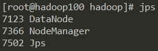
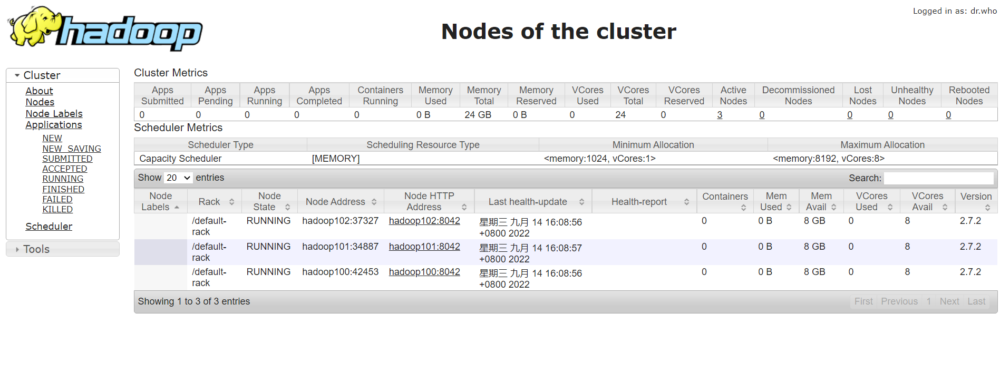

# Hadoop 环境搭建
## 一、虚拟机准备(Centos 6.8)
    1、配置主机名: vim /etc/sysconfig/network
    2、配置网络 ：vim /etc/sysconfig/network-scripts
        主要配置：
            ONBOOT=yes
            BOOTPROTO=static	
            IPADDR=
            NETMASK=
            GATEWAY=
            DNS1=
    3、配置dns：一个集群内所有的主机都要配置
        ip地址  主机名
    4、关闭防火墙：
        service iptables stop
        chkconfig iptables off
    5、重启网络服务：service network restart
    6、安装jdk并配置环境变量
**配置完需要reboot重启**

## 二、安装Hadoop
    1、解压hadoop的压缩包：tar -zxvf hadoop.tar.gz
	2、配置环境变量：vim /etc/profile
```
export HADOOP_HOME=hadoop解压目录
export PATH=$PATH:$HADOOP_HOME/bin:$HADOOP_HOME/sbin
```
	3、编辑文件etc/hadoop/hadoop-env.sh
		找到JAVA_HOME，配置为JAVA_HOME=jdk解压目录
	4、执行 "hadoop version" 出现hadoop的版本信息或者执行 "bin/hadoop" 执行不报错即成功

## 三、配置Hadoop分布式集群
### 1. 准备三台虚拟机并配置网络
### 2. 配置JAVA_HOME
    分别打开hadoop-enc.sh、mapred-env.sh、yarn-env.sh，修改JAVA_HOME=jdk安装目录.
    【以上文件在 hadoop解压目录/etc/hadoop目录下】
### 3、配置集群：（每台机器都要配置）
    以下文件在hadoop解压目录/etc/hadoop目录下
    【NameNode配置在hadoop100上，SecondaryNameNode配置在hadoop102上，ResourceManager配置在hadoop101上】
	【DataNode和DataManager每台机器配置一个】
#### (1) 配置core-site.xml
```xml
<configuration>
  <!-- 指定HDFS中的NameNode地址  -->
  <property>
    <name>fs.defaultFS</name>
    <value>hdfs://hadoop100:9000</value>
  </property>

  <!-- 指定Haddop运行时产生的文件存储的目录  -->
  <property>
    <name>hadoop.tmp.dir</name>
    <value>/opt/hadoop-2.7.2/data/temp</value>
  </property>
</configuration>
```
#### (2) 配置hdfs-site.xml
```xml
<configuration>
  <!-- 指定HDFS副本数目  -->
  <property>
    <name>dfs.replication</name>
    <value>3</value>
  </property>
  
  <!-- 指定hadoop辅助NameNode的地址 -->
  <property>
    <name>dfs.namenode.secondary.http-address</name>
    <value>hadoop102:50090</value>
  </property>
</configuration>
```
#### (3)配置mapred-site.xml
```xml
<configuration>
  <!-- 指定MapReduce运行在YARN上 -->
  
  <property>
    <name>mapreduce.framework.name</name>
    <value>yarn</value>
  </property>

  <!-- 历史服务器端地址 -->
  <property>
    <name>mapreduce.jobhistory.address</name>
    <value>hadoop100:10020</value>
  </property>

  <!-- 历史服务器web端地址 -->
  <property>
    <name>mapreduce.jobhistory.webapp.address</name>
    <value>hadoop100:19888</value>
  </property>
  
</configuration>
```
#### (4) 配置yarn-site.xml
```xml
<configuration>
  <!-- 指定Reducer获取数据的方式 -->
  <property>
    <name>yarn.nodemanager.aux-services</name>
    <value>mapreduce_shuffle</value>
  </property>

  <!-- 指定YARN的ResourceManager的ip地址 -->
  <property>
    <name>yarn.resourcemanager.hostname</name>
    <value>hadoop101</value>
  </property>
  
  <!-- 开启日志聚集功能 -->
  <property>
        <name>yarn.log-aggregation-enable</name>
        <value>true</value>
  </property>

  <!-- 日志保留时间设置7天 -->
  <property>
        <name>yarn.log-aggregation.retain-seconds</name>
        <value>604800</value>
  </property>

</configuration>
```
### 4、手动启动集群
#### (1) hadoop100上执行
```shell script
bin/hdfs namenode -format #格式化NameNode
hadoop-daemon.sh start namenode
hadoop-daemon.sh start datenode
```
#### (2) hadoop101上执行
``hadoop-daemon.sh start datenode``
#### (3) hadoop102上执行
```shell script
hadoop-daemon.sh start datanode
hadoop-daemon.sh start secondarynamenode
```
### 5、配置群启脚本
#### (1) 配置无密登录：
```shell script
ssh-keygen -t rsa #生成密钥
ssh-copy-id 主机名 #发送公钥给主机（此集群内每个主机都要收到执行一遍）
```
#### (2) 配置slaves文件
    写入hadoop100 hadoop101 hadoop102 (以下文件在hadoop解压目录/etc/hadoop目录下）
    【注意：每台机器都要配置】
#### (3)群启和终止：
i) 在配置NameNode的主机上（hadoop100）执行：
``start-dfs.sh``

ii) 在配置了ResourceManager的主机（hadoop101）执行：
``start-yarn.sh``

iii) 在历史服务器上执行：
``mr-jobhistory-daemon.sh start historyserver``

iv) 执行完浏览器访问hadoop100:50070和hadoop101:8088可以看到节点信息

v) 终止集群：
```shell script
stop-dfs.sh
stop-yarn.sh
mr-jobhistory-daemon.sh stop historyserver
```
### 6. 测试Hadoop集群：
#### (1) 查看版本号：

#### (2) 启动HDFS和YARN：



#### (3) HDFS 


#### (4)YARN

