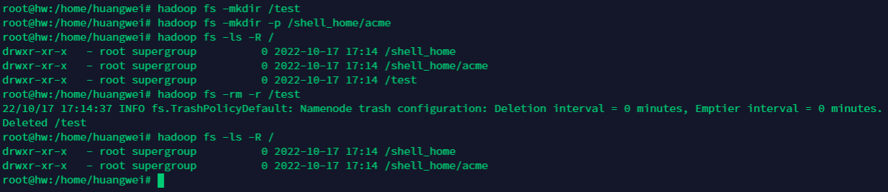
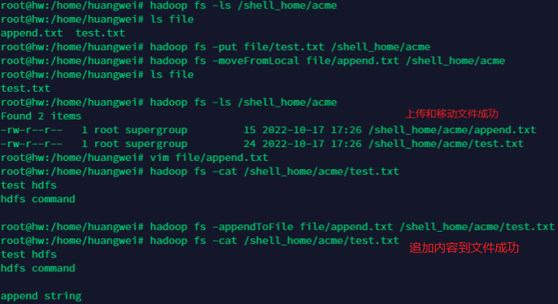
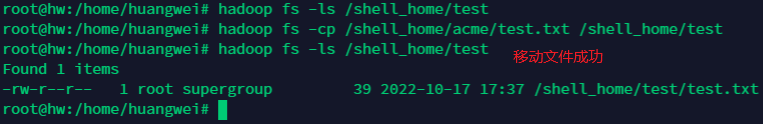
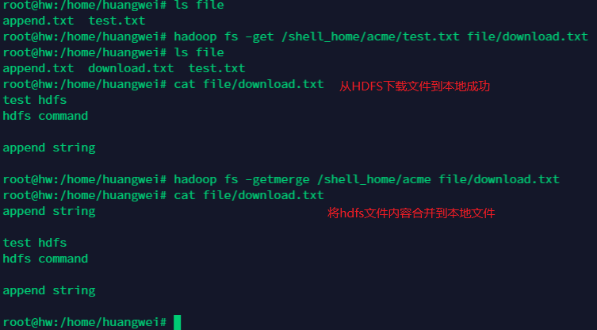
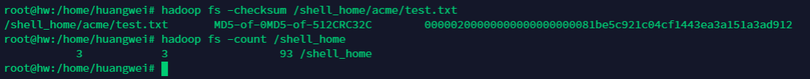
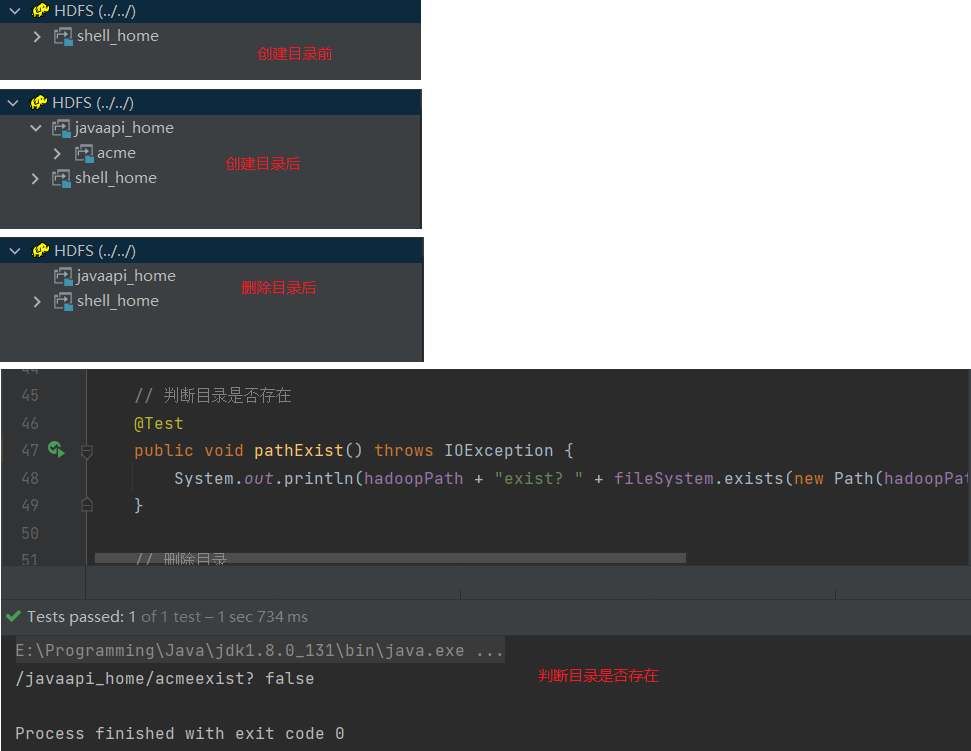
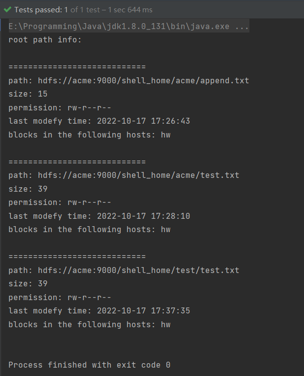
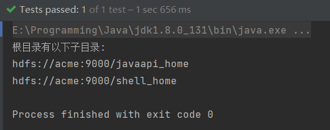
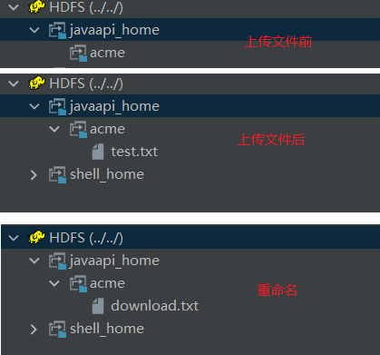
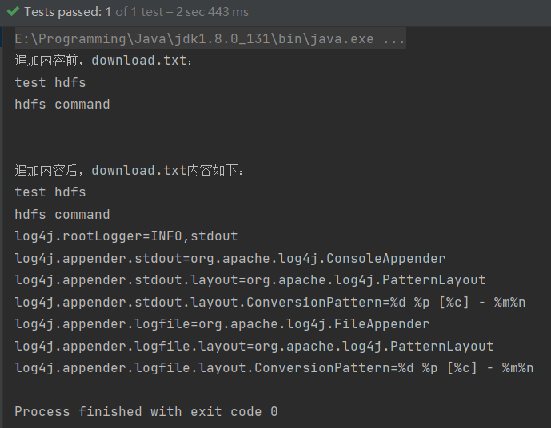

# HDFS 基本操作
## 一、HDFS 命令
### 1. 基本结构
```shell
hadoop fs [-command ] [params]
hdfs dfs [-command] [params]
```

### 2. 基本命令
```shell
hadoop fs -help # 帮助命令
hadoop fs -ls [-R] path # 递归的展示目录
hadoop fs -mkdir [-p] path # 创建目录（-p表示递归创建目录）
hadoop fs -rm [-r] file_path # 删除文件（-r删除文件夹）
```

### 3. 文件双传和下载
#### (1) 本地 -> HDFS
```shell
hadoop fs -put sourceFileOrDir targetDir #将sourceFileOrDir复制到HDFS的targetDir下
hadoop fs -moveFromLocal sourceFileOrDir targetDir #将sourceFileOrDir剪切到HDFS的targetDir下
hadoop fs -appendToFile sourceFileOrDir targetFile #将sourceFileOrDir追加到HDFS的targetFile尾部
```

#### (2) HDFS -> HDFS
```shell
hadoop fs -cp #mv、chown、chgrp、chmod、mkdir、du、df、cat、rm、du、df、tail和linux的命令用法类似
hadoop fs -setrep count FileOrDir #将HDFS上的FileOrDir设置count个副本
```

#### (3) HDFS -> 本地
```shell
hadoop fs -get sourceFileOrDir targetDir #将HDFS上的sourceFileOrDir下载到本地的targetDir
hadoop fs -getmerge sourceDir targetFile #将HDFS上的sourceDir里的所有文件合并到本地的targetFile
```

#### (4) 其他命令
```shell
hadoop fs -checksum hdfsFile # 查看HDFS上文件的校验码信息
hadoop fs -count hdfsDir # 查看指定目录下文件的数目
hadoop fs -rmdir hdfsDir # 删除HDFS中指定的空目录
```


## 二、HDFS Java API
### 1. 准备工作
#### 1.1  解压对应版本的hadoop jar并配置好环境变量

#### 1.2  导入依赖
```xml
<dependencies>
	<dependency>
      <groupId>junit</groupId>
      <artifactId>junit</artifactId>
      <version>4.12</version>
    </dependency>

    <dependency>
      <groupId>log4j</groupId>
      <artifactId>log4j</artifactId>
      <version>1.2.12</version>
    </dependency>
    
    <dependency>
      <groupId>org.apache.hadoop</groupId>
      <artifactId>hadoop-common</artifactId>
      <version>2.7.2</version>
    </dependency>
    
    <dependency>
      <groupId>org.apache.hadoop</groupId>
      <artifactId>hadoop-client</artifactId>
      <version>2.7.2</version>
    </dependency>
    
    <dependency>
      <groupId>org.apache.hadoop</groupId>
      <artifactId>hadoop-hdfs</artifactId>
      <version>2.7.2</version>
    </dependency>
</dependencies>
```
### 2. Java API
#### 2.1 导入包
```java
import org.apache.hadoop.conf.Configuration;
import org.apache.hadoop.fs.FSDataInputStream;
import org.apache.hadoop.fs.FSDataOutputStream;
import org.apache.hadoop.fs.FileSystem;
import org.apache.hadoop.fs.Path;

import java.io.*;
import java.net.URI;
```
#### 2.2 创建连接
```java
URI uri = URI.create("hdfs://ip_address:9000");
Configuration configuration = new Configuration();
// 设置配置信息：出现相同的配置项时，优先选择API中的配置，其次是hdfs-site.xml中的配置，再其次是服务器默认配置
configuration.setInt("dfs.replication", 1);
//创建FileSystem对象
FileSystem fileSystem = FileSystem.get(uri, configuration, "root");
```
#### 2.3 目录管理
##### 2.3.1 基本操作
```java
fileSystem.mkdirs(new Path("/hadoopDir")); // 1. 创建文件夹
fileSystem.delete(new Path("/hadoopDir"));   // 2. 删除文件夹
fileSystem.exist(new Path("/hadoopDir"));   // 3. 判断文件夹是否存在
```

##### 2.3.2 遍历文件
```java
// true表示递归遍历
RemoteIterator<LocatedFileStatus> remoteIterator = fileSystem.listFiles(new Path("/hadoopDir") , true);
/* 输出每个文件的信息 */
while (remoteIterator.hasNext()) {
	FileStatus fileStatus = remoteIterator.next();
	System.out.println("路径: " + fileStatus.getPath().toString());
	System.out.println("权限: " + fileStatus.getPermission().toString());
	System.out.println("大小: " + fileStatus.getLen());
	System.out.println("权限: " + fileStatus.getPermission());
    
    /* 获取文件修改时间 */
    Long timeStamp = fileStatus.getModificationTime(); // 返回的是时间戳,转化为时间日期格式
    SimpleDateFormat format = new SimpleDateFormat("yyyy-MM-dd HH:mm:ss");
    String date = format.format(timeStamp);
    System.out.println("上次修改时间: " + date);
    System.out.println("============================");
    
    /* 获取文件块信息 */
    BlockLocation[] blockLocations = fileStatus.getBlockLocations();
    for (BlockLocation blockLocation : blockLocations) {
        String[] hosts = blockLocation.getHosts();
        System.out.print("blocks in the following hosts: ");
        for (String host : hosts)
        	System.out.println(host + "  ");
    }
}
```

##### 2.3.3 遍历目录
```java
System.out.println("根目录有以下子目录: ");
RemoteIterator<LocatedFileStatus> iterator = fileSystem.listLocatedStatus(new Path("/"));
while (iterator.hasNext()){
	LocatedFileStatus fileStatus = iterator.next();
	if(fileStatus.isDirectory())
		System.out.println(fileStatus.getPath());
}
```

#### 2.4 文件操作
##### 2.4.1 基本操作
```java
fileSystem.copyFromLocalFile(new Path(localPath),
                new Path(remotePath)); // 1. 上传文件
fileSystem.copyToLocalFile(new Path(remotePath),
                new Path(localPath)); // 2. 下载文件
fileSystem.rename(new Path(remotePath), new Path(newRemotePath)); // 3. 重命名
```

##### 2.4.2 追加内容到文件
```java
FSDataOutputStream append = fileSystem.append(new Path(remotePath), 1024);
FileInputStream fileInputStream = new FileInputStream(localPath);
IOUtils.copyBytes(fileInputStream, append, 1024, true);
```
##### 2.4.3 输出文件内容
```java
FSDataInputStream in = fileSystem.open(new Path(remotePath);
BufferedReader d = new BufferedReader(new InputStreamReader(in));
String line;
while ((line = d.readLine()) != null)
	System.out.println(line);
```

#### 2.5 关闭连接
```java
fileSystem.close();
```
### 3. 完整代码
```java
package hdfs;

import org.apache.hadoop.conf.Configuration;
import org.apache.hadoop.fs.*;
import org.apache.hadoop.io.IOUtils;
import org.junit.After;
import org.junit.Before;
import org.junit.Test;

import java.io.BufferedReader;
import java.io.FileInputStream;
import java.io.IOException;
import java.io.InputStreamReader;
import java.net.URI;
import java.text.SimpleDateFormat;

/**
 * @author acme
 * @date 2022/10/14-09:44
 */
public class HDFSClient {

    private FileSystem fileSystem;

    private final String localPath = "F:\\idea_workspace\\Hadoop\\src\\main\\resources";

    private final String hadoopPath = "/javaapi_home/acme";
    @Before
    public void init() throws IOException, InterruptedException {
        URI uri = URI.create("hdfs://acme:9000");
        Configuration configuration = new Configuration();
        // 设置配置信息：出现相同的配置项时，优先选择API中的配置，其次是hdfs-site.xml中的配置，再其次是服务器默认配置
//        configuration.setInt("dfs.replication", 1);
        fileSystem = FileSystem.get(uri, configuration, "root");
    }


    /* 目录操作 */
    // 创建目录
    @Test
    public void makeDir() throws IOException {
        fileSystem.mkdirs(new Path(hadoopPath));
    }

    // 判断目录是否存在
    @Test
    public void pathExist() throws IOException {
        System.out.println(hadoopPath + "exist? " + fileSystem.exists(new Path(hadoopPath)));
    }

    // 删除目录
    @Test
    public void delete() throws IOException {
        fileSystem.delete(new Path(hadoopPath), false);
    }

    // 遍历文件
    @Test
    public void listFiles() throws IOException {
        System.out.println("root path info: \n");
        RemoteIterator<LocatedFileStatus> iterator = fileSystem.listFiles(new Path("/"), true);
        while (iterator.hasNext()){
            System.out.println("============================");
            LocatedFileStatus fileStatus = iterator.next();
            System.out.println("path: " + fileStatus.getPath());
            System.out.println("size: " + fileStatus.getLen());
            System.out.println("permission: " + fileStatus.getPermission());
            SimpleDateFormat format = new SimpleDateFormat("yyyy-MM-dd HH:mm:ss");
            String time = format.format(fileStatus.getModificationTime());
            System.out.println("last modefy time: " + time);

            BlockLocation[] blockLocations = fileStatus.getBlockLocations();
            for (BlockLocation blockLocation : blockLocations) {
                String[] hosts = blockLocation.getHosts();
                System.out.print("blocks in the following hosts: ");
                for (String host : hosts) {
                    System.out.println(host + "  ");
                }
            }
            System.out.println();
        }
    }

    // 遍历子目录
    @Test
    public void listSubDir() throws IOException {
        System.out.println("根目录有以下子目录: ");
        RemoteIterator<LocatedFileStatus> iterator = fileSystem.listLocatedStatus(new Path("/"));
        while (iterator.hasNext()){
            LocatedFileStatus fileStatus = iterator.next();
            if(fileStatus.isDirectory())
                System.out.println(fileStatus.getPath());
        }
    }


    /*
    文件操作
     */
    // 上传
    @Test
    public void copyFromLocalFile() throws IOException {
        fileSystem.copyFromLocalFile(new Path(localPath + "/test.txt"),
                new Path(hadoopPath));
    }

    // 下载
    @Test
    public void copyToLocalFile() throws IOException {
        fileSystem.copyToLocalFile(true, new Path("/log4j.properties"),
                new Path("F:\\"));
    }

    // 重命名
    @Test
    public void rename() throws IOException {
        fileSystem.rename(new Path(hadoopPath + "/test.txt"), new Path(hadoopPath + "/download.txt"));
    }

    // 查看文件内容
    public void printTxt(String filePath) throws IOException {
        Path remotePath = new Path(filePath);

        FSDataInputStream in = fileSystem.open(remotePath);
        BufferedReader d = new BufferedReader(new InputStreamReader(in));
        String line;
        while ((line = d.readLine()) != null) {
            System.out.println(line);
        }
    }

    @Test
    public void testAppend() throws IOException {
        String filePath = hadoopPath + "/download.txt";
        System.out.println("追加内容前，download.txt：");
        printTxt(filePath);

        FSDataOutputStream append = fileSystem.append(new Path(filePath), 1024);
        FileInputStream fileInputStream = new FileInputStream(localPath + "/log4j.properties");
        IOUtils.copyBytes(fileInputStream, append, 1024, true);

        System.out.println("\n\n追加内容后，download.txt内容如下：");
        printTxt(filePath);

    }

    @After
    public void destroy() throws IOException {
        fileSystem.close();
    }
}
```